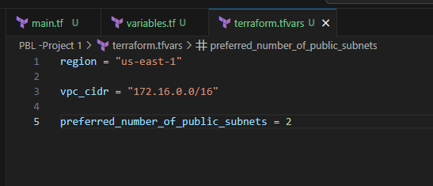

# Automating AWS Infrastructure Creation With IAC (Terraform)

### PREREQUISITES

In this project we are tasked with the responsibility to create AWS Infrastructure using Terraform automation. 

- Create an `IAM` user, name it `terraform` (ensure that the user has only programatic access to your AWS account) and grant this user `AdministratorAccess` permissions.

- Copy the secret access key and access key ID. Save them in a notepad temporarily.
- Configure programmatic access from your workstation to connect to AWS using the access keys copied above and a Python SDK (boto3). You must have Python 3.6 or higher on your workstation.

>           pip install boto3

- Install AWS CLI and configure programmatic access using

>           aws configure

Paste in the access key ID and secret access key when prompted. Leave everything else as default.

- Create an S3 bucket to store Terraform state files.

Paste the following python code in a file and run to ensure programmatic access was successfully configured.

        import boto3
        s3 = boto3.resource('s3')
        for bucket in s3.buckets.all():
            print(bucket.name)

### STEP 1.

## VPC | SUBNETS | SECURITY GROUPS

- Open `VS Code`
- Create a folder called `PBL`
- Create a file in the folder, name it `main.tf`
- Add AWS as a provider, and a resource to create a VPC in the main.tf file. Provider block informs Terraform that we intend to build infrastructure within AWS while Resource block will create a `VPC`.

        provider "aws" {
        region = "us-east-1"
        }

        #Create VPC
        resource "aws_vpc" "main" {
        cidr_block = "172.16.0.0/16"

        }

Notice that a new directory has been created: `.terraform`.... This is where Terraform keeps plugins. Generally, it is safe to delete this folder. It just means that you must execute terraform init again, to download them.

Moving on, let us create the only resource we just defined. `aws_vpc`. But before we do that, we should check to see what terraform intends to create before we tell it to go ahead and create it.

>           terraform plan

Then, if you are happy with changes planned, execute terraform apply

>           terraform apply

If you check the AWS console. You will see the created VPC and Subnets

### STEP 2

## Subnets resource section

According to our architectural design, we require 6 subnets:

- 2 public
- 2 private for webservers
- 2 private for data layer

Let us create the first 2 `Public Subnets`.

Add below configuration to the `main.tf` file:

        # Create public subnets1
            resource "aws_subnet" "public1" {
            vpc_id                     = aws_vpc.main.id
            cidr_block                 = "172.16.0.0/24"
            map_public_ip_on_launch    = true
            availability_zone          = "us-east-1a"

        }

        # Create public subnet2
            resource "aws_subnet" "public2" {
            vpc_id                     = aws_vpc.main.id
            cidr_block                 = "172.16.1.0/24"
            map_public_ip_on_launch    = true
            availability_zone          = "us-east-1b"
        }

We are creating 2 subnets, therefore declaring 2 resource blocks – one for each of the subnets. We are using the vpc_id argument to interpolate the value of the VPC id by setting it to `aws_vpc.main.id`. This way, Terraform knows inside which VPC to create the subnet. Run terraform plan and terraform apply

#### Observations:

Hard coded values: Remember our best practice hint from the beginning? Both the `availability_zone` and `cidr_block` arguments are hard coded. We should always endeavour to make our work dynamic. Multiple Resource Blocks: Notice that we have declared multiple resource blocks for each subnet in the code. This is bad coding practice. We need to create a single resource block that can dynamically create resources without specifying multiple blocks. Now let us improve our code by refactoring it.

First, destroy the current infrastructure. Since we are still in development, this is totally fine. Otherwise, DO NOT DESTROY an infrastructure that has been deployed to production.

To destroy whatever has been created run 

>           terraform destroy 

## FIXING THE PROBLEMS BY CODE REFACTORING

### Step 3

We will now refactor the code to make it dynamic. To do this we will introduce variables.

1. Starting with the `provider block`, declare a variable named `region`, give it a default value, and update the provider section by referring to the declared variable.

        variable "region" {
                default = "us-east-1"
        }

        provider "aws" {
                region = var.region
        }

2. Do the same to cidr value in the vpc block, and all the other arguments.

        variable "region" {
                default = "us-east-1"
            }

        variable "vpc_cidr" {
            default = "172.16.0.0/16"
        }

        provider "aws" {
        region = var.region
        }

        #Create VPC
        resource "aws_vpc" "main" {
        cidr_block  = var.vpc_cidr

        }

3. We are just going to introduce some interesting concepts. **Loops & Data sources**

Terraform has a functionality that allows us to pull data which exposes information to us. Let us fetch ***Availability zones*** from `AWS`, and replace the hard coded value in the subnet’s availability_zone section.

               #Get list of availability zones
                data "aws_availability_zones" "available" {
                state = "available"
                }

4. To make use of this new data resource, we will need to introduce a count argument in the subnet block: Something like this.

        #Create public subnet1
        resource "aws_subnet" "public" { 
            count                   = 2
            vpc_id                  = aws_vpc.main.id
            cidr_block              = "172.16.1.0/24"
            map_public_ip_on_launch = true
            availability_zone       = data.aws_availability_zones.available.names[count.index]

        }

5. But we still have a problem. If we run Terraform with this configuration, it may succeed for the first time, but by the time it goes into the second loop, it will fail because we still have `cidr_block` **hard coded**. The same cidr_block cannot be created twice within the same VPC. So, we have a little more work to do.

We will introduce a function `cidrsubnet()` to make this happen. It accepts 3 parameters.

        #Create public subnet1
        resource "aws_subnet" "public" { 
            count                   = 2
            vpc_id                  = aws_vpc.main.id
            cidr_block              = cidrsubnet(var.vpc_cidr, 4 , count.index)
            map_public_ip_on_launch = true
            availability_zone       = data.aws_availability_zones.available.names[count.index]

        }

6. We can introduce `length()` function, which basically determines the length of a given list, `map`, or `string`.
Since `data.aws_availability_zones.available.names` returns a list like `["eu-central-1a", "eu-central-1b", "eu-central-1c"]` we can pass it into a lenght function and get number of the AZs.

Now we can simply update the public subnet block like this

        resource "aws_subnet" "public" { 
            count                   = length(data.aws_availability_zones.available.names)
            vpc_id                  = aws_vpc.main.id
            cidr_block              = cidrsubnet(var.vpc_cidr, 4 , count.index)
            map_public_ip_on_launch = true
            availability_zone       = data.aws_availability_zones.available.names[count.index]

        }

#### Observations:

What we have now, is sufficient to create the subnet resource required. But if you observe, it is not satisfying our business requirement of just 2 subnets. The length function will return number 3 to the count argument, but what we actually need is 2. Now, let us fix this.

7. Declare a variable to store the desired number of public subnets, and set the default value

        variable "preferred_number_of_public_subnets" {
        default = 2
        }

8. Next, update the count argument with a condition. Terraform needs to check first if there is a desired number of subnets. Otherwise, use the data returned by the lenght function. See how that is presented below.

- The first part `var.preferred_number_of_public_subnets == null` checks if the value of the variable is set to null or has some value defined. 
- The second part ? and length`(data.aws_availability_zones.available.names)` means, if the first part is true, then use this. In other words, if preferred number of public subnets is null (Or not known) then set the value to the data returned by lenght function.
- The third part : and `var.preferred_number_of_public_subnets` means, if the first condition is false, i.e preferred number of public subnets is not null then set the value to whatever is definied in `var.preferred_number_of_public_subnets`

Now our `main.tf` looks this:

                #Get the list of availability zones
                data "aws_availability_zones" "available" {
                state = "available" 
                }

                provider "aws" {
                region = var.region
                }

                #Create a VPC
                resource "aws_vpc" "main" {
                cidr_block = var.vpc_cidr
                }

                #Creating public subnets
                resource "aws_subnet" "public" {
                count = var.preferred_number_of_public_subnets == null ? lenght(data.aws_availability_zones.available.names) : var.preferred_number_of_public_subnets
                vpc_id     = aws_vpc.main.id
                cidr_block = cidrsubnet(var.vpc_cidr, 4 , count.index)
                map_public_ip_on_launch = true
                availability_zone = data.aws_availability_zones.available.names[count.index]

                
                }

#### Step 4 
## Introducing variables.tf & terraform.tfvars

Instead of havng a long list of variables in `main.tf` file, we can actually make our code a lot more readable and better structured by moving out some parts of the configuration content to other files.

We can create a file called `variables.tf` and put all the variables declaration we need in it. Also we will create a `terraform.tfvars` file and put all the values of the variables values in it. 

Your directory structure should look like this:

                .
                ├── main.tf
                ├── terraform.tfstate
                ├── terraform.tfstate.backup
                ├── terraform.tfvars
                └── variables.tf

                0 directories, 5 files
                

***Variable.tf*** file:

                variable "region" {
                        default = "us-east-1"
                }

                variable "vpc_cidr" {
                        default = "172.16.0.0/16"
                }

                variable "preferred_number_of_public_subnets" {
                default = null
                }

***terraform.tfvars*** file:

                region = "us-east-1"

                vpc_cidr = "172.16.0.0/16" 

                preferred_number_of_public_subnets = 2

***main.tf*** file:

                #Get the list of availability zones
                data "aws_availability_zones" "available" {
                state = "available" 
                }

                provider "aws" {
                region = var.region
                }

                #Create a VPC
                resource "aws_vpc" "main" {
                cidr_block = var.vpc_cidr
                }

                #Creating public subnets
                resource "aws_subnet" "public" {
                count = var.preferred_number_of_public_subnets == null ? lenght(data.aws_availability_zones.available.names) : var.preferred_number_of_public_subnets
                vpc_id     = aws_vpc.main.id
                cidr_block = cidrsubnet(var.vpc_cidr, 4 , count.index)
                map_public_ip_on_launch = true
                availability_zone = data.aws_availability_zones.available.names[count.index]

                
                }

You can now run `terraform plan` now to see the configuration of the infrastructure.

>               terraform plan

Once you are satisfied with what terraform is about to create, run:

>               terraform apply

